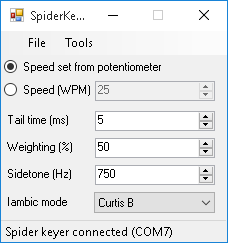
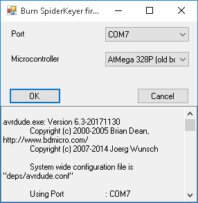
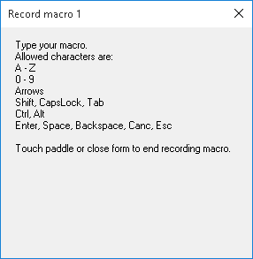

SpiderKeyboard
==============

Introduction
------------

The [Spider Keyer](http://ok1fig.nagano.cz/SpiderKeyer/SpiderKeyer.htm) is a continuous wave keyer for iambic paddles created by Czech amateur radio operator Petr Mal&yacute; ([OK1FIG](https://www.qrz.com/lookup/OK1FIG)).
This C# program allows the user to use the SpiderKeyer as a keyboard, mapping each CW sequence to a symbol.

The following are some screenshots:

 

 

 

Features
--------

- Automatic detection and reconnection of the SpiderKeyer
- The application can be minimized in the tray bar
- The SpiderKeyer's speed, tail time, weighting, sidetone and iambic mode can be set from the main form
- Five macros can be recorded from the real keyboard and played back with the paddle
- The SpiderKeyer's firmware can be burned on a brand new Arduino Nano without using the Arduino IDE.

Recognized symbols
------------------

<table>
<tr><th>CW</th><th>Key</th><th>CW</th><th>Key</th><th>CW</th><th>Key</th></tr>
<tr><td>.-</td><td>a</td>
<td>-...</td><td>b</td>
<td>-.-.</td><td>c</td></tr>
<tr><td>-..</td><td>d</td>
<td>.</td><td>e</td>
<td>..-.</td><td>f</td></tr>
<tr><td>--.</td><td>g</td>
<td>....</td><td>h</td>
<td>..</td><td>i</td></tr>
<tr><td>.---</td><td>j</td>
<td>-.-</td><td>k</td>
<td>.-..</td><td>l</td></tr>
<tr><td>--</td><td>m</td>
<td>-.</td><td>n</td>
<td>---</td><td>o</td></tr>
<tr><td>.--.</td><td>p</td>
<td>--.-</td><td>q</td>
<td>.-.</td><td>r</td></tr>
<tr><td>...</td><td>s</td>
<td>-</td><td>t</td>
<td>..-</td><td>u</td></tr>
<tr><td>...-</td><td>v</td>
<td>.--</td><td>w</td>
<td>-..-</td><td>x</td></tr>
<tr><td>-.--</td><td>y</td>
<td>--..</td><td>z</td>
<td>-----</td><td>0</td></tr>
<tr><td>.----</td><td>1</td>
<td>..---</td><td>2</td>
<td>...--</td><td>3</td></tr>
<tr><td>....-</td><td>4</td>
<td>.....</td><td>5</td>
<td>-....</td><td>6</td></tr>
<tr><td>--...</td><td>7</td>
<td>---..</td><td>8</td>
<td>----.</td><td>9</td></tr>
<tr><td>--..--</td><td>,</td>
<td>.-.-.-</td><td>.</td>
<td>-.--.</td><td>(</td></tr>
<tr><td>-.--.-</td><td>)</td>
<td>.-.-.</td><td>+</td>
<td>-....-</td><td>-</td></tr>
<tr><td>-...-</td><td>=</td>
<td>...-..-</td><td>$</td>
<td>-.-.--</td><td>!</td></tr>
<tr><td>..--..</td><td>?</td>
<td>-..-.</td><td>/</td>
<td>.--.-.</td><td>@</td></tr>
<tr><td>.-...</td><td>&amp;</td>
<td>.----.</td><td>'</td>
<td>.-..-.</td><td>"</td></tr>
<tr><td>---...</td><td>:</td>
<td>.-.-.-.</td><td>;</td>
<td>.-----</td><td>Macro 1</td></tr>
<tr><td>..----</td><td>Macro 2</td>
<td>...---</td><td>Macro 3</td>
<td>....--</td><td>Macro 4</td></tr>
<tr><td>.....-</td><td>Macro 5</td>
<td></td><td></td>
<td></td><td></td></tr>
</table>

Remarks
-------

- The included `.hex` files do **NOT** include the Arduino bootloader, therefore using the Burn firmware feature will result in a SpiderKeyer which can't be reprogrammed without an ISP
- The SpiderKeyer firmware required for this tool is slightly different than the original provided by OK1FIG.